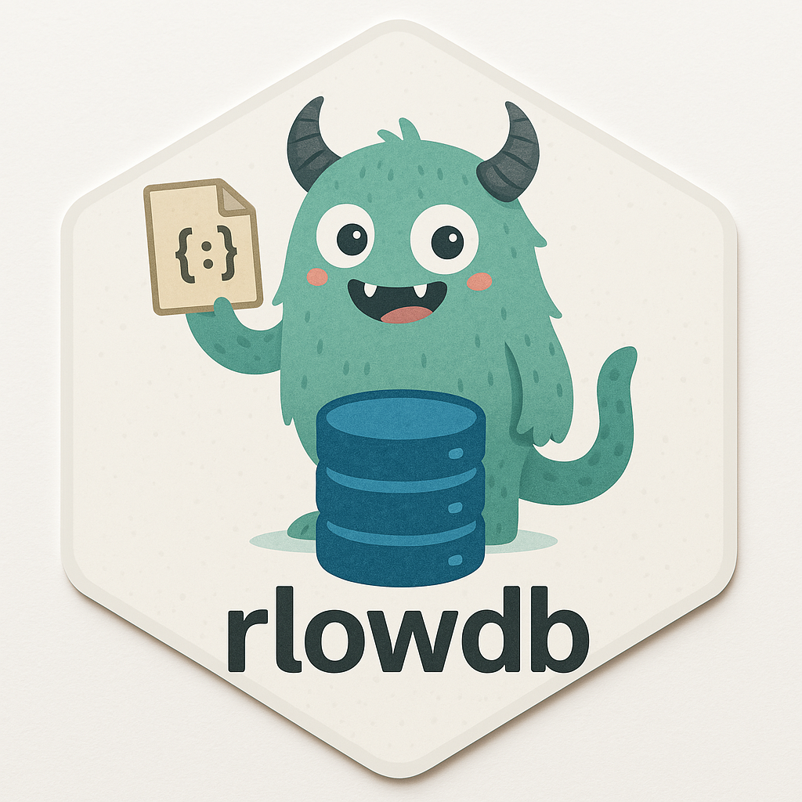

<!-- README.md is generated from README.Rmd. Please edit that file -->

```{r, include = FALSE}
knitr::opts_chunk$set(
  collapse = TRUE,
  comment = "#>",
  fig.path = "man/figures/README-",
  out.width = "100%"
)
```

# rlowdb <a></a>


<!-- badges: start -->
[](https://app.codecov.io/gh/feddelegrand7/rlowdb?branch=main)
[](https://github.com/feddelegrand7/rlowdb/actions/workflows/R-CMD-check.yaml)
[](https://CRAN.R-project.org/package=rlowdb)
[](https://github.com/feddelegrand7/rlowdb)
[](https://cran.r-project.org/package=rlowdb)
[](https://cran.r-project.org/package=rlowdb)

<!-- badges: end -->

`rlowdb` is a lightweight, JSON-based database for R, inspired by [LowDB](https://github.com/typicode/lowdb) from JavaScript. It provides a simple and efficient way to store, retrieve, update, and delete structured data without the need for a full database system.

`rlowdb` relies on the [yyjsonr](https://github.com/coolbutuseless/yyjsonr) package, which is extremely fast, to `read/write` your `json` database. 

## Features

- **Lightweight & File-Based**: Uses JSON for persistent storage.
- **Easy-to-Use API**: Supports CRUD operations (Create, Read, Update, Delete).
- **Flexible Queries**: Allows filtering with expressive conditions.
- **No External Dependencies**: No need for SQL or additional database software.

## Installation

You can install `rlowdb` from `CRAN` with:

```{r, eval=FALSE}
install.packages("rlowdb")
```

You can also install the development version from `Github` with:
```{r, eval=FALSE}
devtools::install_github("feddelegrand7/rlowdb")
```

## Usage
### Initializing the Database
To start using `rlowdb``, create a new database instance by specifying a JSON file:

```{r}
library(rlowdb)
db <- rlowdb$new(file_path = "DB.json")
```

If the `json` file is not available, `rlowdb` will create it automatically when inserting data.

### Verbosity

When creating the instance, you can set the the `verbose` parameter to `TRUE`, this way you'll get an informative message each time you operate on your `DB`. The default is `FALSE`. 

```{r}
db <- rlowdb$new(file_path = "DB.json", verbose = FALSE)
```

### Auto Commit

By default, when creating a new instance of `rlowdb`, the `auto_commit` parameter will be set to `TRUE` meaning that each time you make a modification to your `DB`, the underlying `json` file will be __immediately__ saved and the new state of the file will overwrite the previous one. 

On the other hand if you set the `auto_commit` parameter to `FALSE`, it is possible to make changes to your `DB` but only commit (persist the changes) to your underlying file when you decide to. To do that, you can use the `commit()` method.

```{r, eval=FALSE}
db <- rlowdb$new(file_path = "DB.json", auto_commit = FALSE)
```

### Default Values

You can include default values using the `default_values` parameter which takes a named list of lists specifying default key-value pairs to be included when inserting new records into the database. The structure follows the format:

```{r, eval=FALSE}
# this is just an example, do not run

default_values <- list(
  collection_name = list(
    key_name_1 = value_1,
    key_name_2 = value_2,
    key_name_n = value_n
  )
)

db <- rlowdb$new(file_path = "DB.json",  default_values = default_values) 
```
- `collection_name`: The name of the collection (or table) where the default values will apply.
- `key_name_n`: The name of a field within a record.
- `value`: The default value to assign to the corresponding field when a new record is inserted.

### Pretty output

```{r}
db <- rlowdb$new(file_path = "DB.json", pretty = FALSE)
```

When initiating your database, you can set the `pretty` parameter to `TRUE`, this way, the `json` output will be `pretty` formatted. By default, the `pretty` parameter is set to `FALSE` to enhance performance.


### Schema 

Using the `set_schema` method, you can defines a validation schema for a specific `collection.` Once a schema is set, all future `insert()` and `update()` operations on that collection will be validated against the specified rules before they are committed to the database.

```{r, error=TRUE}
# Define a schema for the 'users' collection
db$set_schema(collection = "users", list(
  id    = "numeric",
  name  = function(x) is.character(x) && nchar(x) > 0,
  age   = function(x) is.numeric(x) && x >= 0,
  email = NULL  # Optional field
))

# Attempt to insert an invalid record (fails validation)
try(db$insert("users", list(id = "1", name = "")))
```

At any time, you can retrieve the defined schema using the `get_schema()` method. You can also delete the schema by setting it to `NULL`: 

```{r}
db$set_schema(collection = "users", NULL)
```


### Inserting Data

The `insert` method takes two parameters, a `collection` and a `record`, think of the `collection` parameter as a `table` in the __SQL__ world. Think of the `record` parameter as a `list` of names, each name/value pair representing a specific column and it's value.

Add records to a collection:

```{r}
db$insert(
  collection = "users", 
  record = list(id = 1, name = "Ali", age = 30)
)
db$insert(
  collection = "users", 
  record = list(id = 2, name = "Bob", age = 25)
)

db$insert(
  collection = "users", 
  record = list(id = 3, name = "Alice", age = 30)
)
```


### Transaction

Using the `transaction` method, you can insert a set of records and if an error occurs in the process, a `rollback` will be triggered to restore the initial state of the database. Note that the insertion has to be operated using a function: 

```{r}
db$count("users")
```


```{r, error=TRUE}
db$transaction(function() {
    db$insert("users", list(name = "Zlatan", age = 40))
    db$insert("users", list(name = "Neymar", age = 28))
    stop("some errors")
    db$insert("users", list(name = "Ronaldo", age = 30))
})
```

```{r}
db$count("users")
```

### Retrieving Data

Get all stored data:

```{r}
db$get_data()
```

Get data from a specific collection: 

```{r}
db$get_data_collection("users")
```

Get data from a specific key: 

```{r}
db$get_data_key("users", "name")
```

Find a specific record:

```{r}
db$find(collection = "users", key = "id", value = 1)
```

### Updating Records

Modify existing records:

```{r}
db$update(
  collection = "users", 
  key = "id", 
  value = 1, 
  new_data = list(age = 31)
)

db$get_data()
```

The `upsert` methods allows you to update a record if it exists, otherwise, it will be inserted. Note that the collection and the key need to exist:

```{r}
db$upsert(
  collection = "users", 
  key = "id", 
  value = 1, 
  new_data = list(age = 25)
)

db$get_data()
```

```{r}
db$upsert(
  collection = "users", 
  key = "id", 
  value = 100, 
  new_data = list(age = 25)
)

db$get_data()
```


### Deleting Records

```{r}
db$delete(collection = "users", key = "id", value = 100) 

db$get_data()
```

### Bulk Inserting

You can insert many records at once using the `buld_insert` method: 

```{r}
db$bulk_insert("users", list(
    list(id = 1, name = "Antoine", age = 52),
    list(id = 2, name = "Omar", age = 23),
    list(id = 3, name = "Nabil", age = 41)
))
```

### Querying Data

Find users older than 25:

```{r}
db$query(collection = "users", condition = "age > 25")
```

Query with multiple conditions:

```{r}
db$query(collection = "users", condition = "age > 20 & id > 1")
```

### Filter Data

The `filter` method allows you to apply a predicate function (a function that returns `TRUE` or `FALSE`) in order to get a specific set of records:

```{r}
db$filter("users", function(x) {
  x$age > 30
})
```


### Searching Data

The `search` method allows you to search within `character` fields a specific record. You can also use `regex`:

```{r}
db$search("users", "name", "^Ali", ignore.case = FALSE)
```

```{r}
db$search("users", "name", "alice", ignore.case = TRUE)
```

### Listing the collections

The `list_collections` method returns the names of the collections within your DB:

```{r}
db$list_collections()
```

### Counting 

Using the `count` method, you can get the number of records a collection has:

```{r}
db$count(collection = "users") 
```


### Check if exists

It possible to verify if a `collection`, a `key` or a `value` exists within your `DB`:

```{r}
db$exists_collection(collection = "users")
```

```{r}
db$exists_collection(collection = "nonexistant")
```
```{r}
db$exists_key(collection = "users", key = "name")
```
```{r}
db$exists_value(
  collection = "users",
  key = "name",
  value = "Alice"
)
```

```{r}
db$exists_value(
  collection = "users",
  key = "name",
  value = "nonexistant"
)
```

### DB status

Using the `status` method, you can at each time get some valuable information about the state of your `DB`: 

```{r}
db$status()
```


### Clear, Drop Data

It is possible to `clear` a collection. This will remove all the elements belonging to the collection but not drop the collection it self: 

```{r}
db$insert(collection = "countries", record = list(id = 1, country = "Algeria", continent = "Africa"))

db$insert(collection = "countries", record = list(id = 1, country = "Germany", continent = "Europe"))

db$get_data()
```

Now, look what happened when we use the `clear` method on the `countries` collection: 

```{r}
db$clear("countries")

db$get_data()
```

Using the `drop` method, one can drop a whole collection: 

```{r}
db$drop(collection = "countries")
db$get_data()
```

Finally, `drop_all` will drop all the `collections` within your `DB`: 

```{r}
db$drop_all()
db$get_data()
```

### Creating a Backup 

You can create at any time a backup for your database using the `backup` method: 

```{r}
db$backup("DB_backup.json")
```

### Restoring a database

You can restore a backup database or any preexisting DB using the `restore` method:

```{r}
db$restore("DB_backup.json")
```

### Error Handling

`rlowdb` provides error handling for common issues. For example, attempting to update a collection that does not exist will result in an informative error: 

```{r, error=TRUE}
db$update(
  collection = "nonexistant", 
  key = "id",
  value = 1, 
  new_data = list(age = 40)
)  
```

### Future Features

- Support for nested data structures.
- More advanced query capabilities.
- Compatibility with alternative file formats (e.g., CSV, SQLite).


## Code of Conduct

Please note that the ralger project is released with a [Contributor Code of Conduct](https://contributor-covenant.org/version/2/0/CODE_OF_CONDUCT.html). By contributing to this project, you agree to abide by its terms.


```{r, echo=FALSE}
unlink("DB.json")
unlink("DB_backup.json")
```


