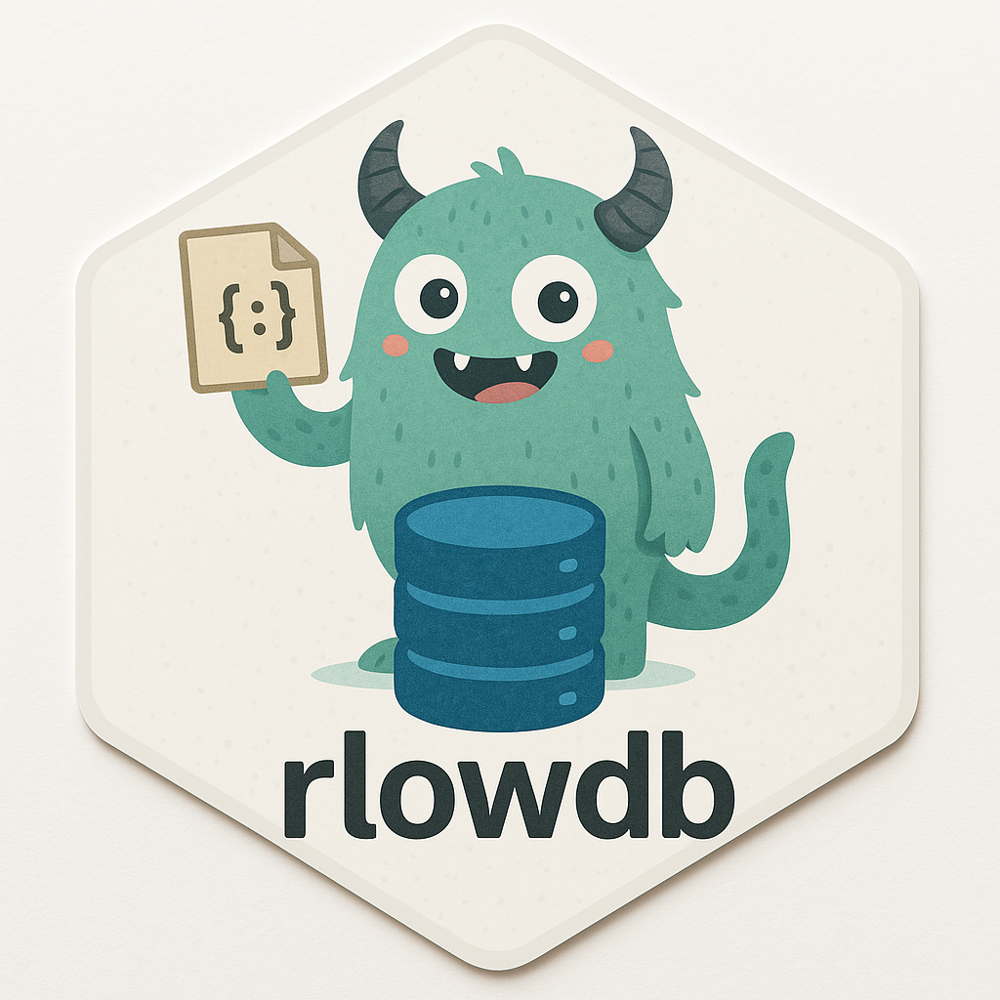

<!-- README.md is generated from README.Rmd. Please edit that file -->

# rlowdb <a></a>

<!-- badges: start -->

[](https://app.codecov.io/gh/feddelegrand7/rlowdb?branch=main)
[](https://github.com/feddelegrand7/rlowdb/actions/workflows/R-CMD-check.yaml)
[](https://CRAN.R-project.org/package=rlowdb)
[](https://github.com/feddelegrand7/rlowdb)
[](https://cran.r-project.org/package=rlowdb)
[](https://cran.r-project.org/package=rlowdb)

<!-- badges: end -->

`rlowdb` is a lightweight, JSON-based database for R, inspired by
[LowDB](https://github.com/typicode/lowdb) from JavaScript. It provides
a simple and efficient way to store, retrieve, update, and delete
structured data without the need for a full database system.

## Features

- **Lightweight & File-Based**: Uses JSON for persistent storage.
- **Easy-to-Use API**: Supports CRUD operations (Create, Read, Update,
  Delete).
- **Flexible Queries**: Allows filtering with expressive conditions.
- **No External Dependencies**: No need for SQL or additional database
  software.

## Installation

You can install `rlowdb` from `CRAN` with:

``` r
install.packages("rlowdb")
```

You can also install the development version from `Github` with:

``` r
devtools::install_github("feddelegrand7/rlowdb")
```

## Usage

### Initializing the Database

To start using \`rlowdb\`\`, create a new database instance by
specifying a JSON file:

``` r
library(rlowdb)
db <- rlowdb$new("DB.json")
```

### Inserting Data

The `insert` method takes two parameters, a `collection` and a `record`,
think of the `collection` parameter as a `table` in the **SQL** world.
Think of the `record` parameter as a `list` of names, each name/value
pair representing a specific column and it’s value.

Add records to a collection:

``` r
db$insert(
  collection = "users", 
  record = list(id = 1, name = "Ali", age = 30)
)
db$insert(
  collection = "users", 
  record = list(id = 2, name = "Bob", age = 25)
)

db$insert(
  collection = "users", 
  record = list(id = 3, name = "Alice", age = 30)
)
```

### Transaction

Using the `transaction` method, you can insert a set of records and if
an error occurs in the process, a `rollback` will be triggered to
restore the initial state of the database. Note that the insertion has
to be operated using a function:

``` r
db$count("users")
#> [1] 3
```

``` r
db$transaction(function() {
    db$insert("users", list(name = "Zlatan", age = 40))
    db$insert("users", list(name = "Neymar", age = 28))
    stop("some errors")
    db$insert("users", list(name = "Ronaldo", age = 30))
})
#> Error in `value[[3L]]()`:
#> ! Transaction failed: some errors
```

``` r
db$count("users")
#> [1] 3
```

### Retrieving Data

Get all stored data:

``` r
db$get_data()
#> $users
#> $users[[1]]
#> $users[[1]]$id
#> [1] 1
#> 
#> $users[[1]]$name
#> [1] "Ali"
#> 
#> $users[[1]]$age
#> [1] 30
#> 
#> 
#> $users[[2]]
#> $users[[2]]$id
#> [1] 2
#> 
#> $users[[2]]$name
#> [1] "Bob"
#> 
#> $users[[2]]$age
#> [1] 25
#> 
#> 
#> $users[[3]]
#> $users[[3]]$id
#> [1] 3
#> 
#> $users[[3]]$name
#> [1] "Alice"
#> 
#> $users[[3]]$age
#> [1] 30
```

Get data from a specific collection:

``` r
db$get_data_collection("users")
#> [[1]]
#> [[1]]$id
#> [1] 1
#> 
#> [[1]]$name
#> [1] "Ali"
#> 
#> [[1]]$age
#> [1] 30
#> 
#> 
#> [[2]]
#> [[2]]$id
#> [1] 2
#> 
#> [[2]]$name
#> [1] "Bob"
#> 
#> [[2]]$age
#> [1] 25
#> 
#> 
#> [[3]]
#> [[3]]$id
#> [1] 3
#> 
#> [[3]]$name
#> [1] "Alice"
#> 
#> [[3]]$age
#> [1] 30
```

Get data from a specific key:

``` r
db$get_data_key("users", "name")
#> [1] "Ali"   "Bob"   "Alice"
```

Find a specific record:

``` r
db$find(collection = "users", key = "id", value = 1)
#> [[1]]
#> [[1]]$id
#> [1] 1
#> 
#> [[1]]$name
#> [1] "Ali"
#> 
#> [[1]]$age
#> [1] 30
```

### Updating Records

Modify existing records:

``` r
db$update(
  collection = "users", 
  key = "id", 
  value = 1, 
  new_data = list(age = 31)
)

db$get_data()
#> $users
#> $users[[1]]
#> $users[[1]]$id
#> [1] 1
#> 
#> $users[[1]]$name
#> [1] "Ali"
#> 
#> $users[[1]]$age
#> [1] 31
#> 
#> 
#> $users[[2]]
#> $users[[2]]$id
#> [1] 2
#> 
#> $users[[2]]$name
#> [1] "Bob"
#> 
#> $users[[2]]$age
#> [1] 25
#> 
#> 
#> $users[[3]]
#> $users[[3]]$id
#> [1] 3
#> 
#> $users[[3]]$name
#> [1] "Alice"
#> 
#> $users[[3]]$age
#> [1] 30
```

The `upsert` methods allows you to update a record if it exists,
otherwise, it will be inserted. Note that the collection and the key
need to exist:

``` r
db$upsert(
  collection = "users", 
  key = "id", 
  value = 1, 
  new_data = list(age = 25)
)

db$get_data()
#> $users
#> $users[[1]]
#> $users[[1]]$id
#> [1] 1
#> 
#> $users[[1]]$name
#> [1] "Ali"
#> 
#> $users[[1]]$age
#> [1] 25
#> 
#> 
#> $users[[2]]
#> $users[[2]]$id
#> [1] 2
#> 
#> $users[[2]]$name
#> [1] "Bob"
#> 
#> $users[[2]]$age
#> [1] 25
#> 
#> 
#> $users[[3]]
#> $users[[3]]$id
#> [1] 3
#> 
#> $users[[3]]$name
#> [1] "Alice"
#> 
#> $users[[3]]$age
#> [1] 30
```

``` r
db$upsert(
  collection = "users", 
  key = "id", 
  value = 100, 
  new_data = list(age = 25)
)

db$get_data()
#> $users
#> $users[[1]]
#> $users[[1]]$id
#> [1] 1
#> 
#> $users[[1]]$name
#> [1] "Ali"
#> 
#> $users[[1]]$age
#> [1] 25
#> 
#> 
#> $users[[2]]
#> $users[[2]]$id
#> [1] 2
#> 
#> $users[[2]]$name
#> [1] "Bob"
#> 
#> $users[[2]]$age
#> [1] 25
#> 
#> 
#> $users[[3]]
#> $users[[3]]$id
#> [1] 3
#> 
#> $users[[3]]$name
#> [1] "Alice"
#> 
#> $users[[3]]$age
#> [1] 30
#> 
#> 
#> $users[[4]]
#> $users[[4]]$id
#> [1] 100
#> 
#> $users[[4]]$age
#> [1] 25
```

### Deleting Records

``` r
db$delete(collection = "users", key = "id", value = 100) 

db$get_data()
#> $users
#> $users[[1]]
#> $users[[1]]$id
#> [1] 1
#> 
#> $users[[1]]$name
#> [1] "Ali"
#> 
#> $users[[1]]$age
#> [1] 25
#> 
#> 
#> $users[[2]]
#> $users[[2]]$id
#> [1] 2
#> 
#> $users[[2]]$name
#> [1] "Bob"
#> 
#> $users[[2]]$age
#> [1] 25
#> 
#> 
#> $users[[3]]
#> $users[[3]]$id
#> [1] 3
#> 
#> $users[[3]]$name
#> [1] "Alice"
#> 
#> $users[[3]]$age
#> [1] 30
```

### Bulk Inserting

You can insert many records at once using the `buld_insert` method:

``` r
db$bulk_insert("users", list(
    list(id = 1, name = "Antoine", age = 52),
    list(id = 2, name = "Omar", age = 23),
    list(id = 3, name = "Nabil", age = 41)
))
```

### Querying Data

Find users older than 25:

``` r
db$query(collection = "users", condition = "age > 25")
#> [[1]]
#> [[1]]$id
#> [1] 3
#> 
#> [[1]]$name
#> [1] "Alice"
#> 
#> [[1]]$age
#> [1] 30
#> 
#> 
#> [[2]]
#> [[2]]$id
#> [1] 1
#> 
#> [[2]]$name
#> [1] "Antoine"
#> 
#> [[2]]$age
#> [1] 52
#> 
#> 
#> [[3]]
#> [[3]]$id
#> [1] 3
#> 
#> [[3]]$name
#> [1] "Nabil"
#> 
#> [[3]]$age
#> [1] 41
```

Query with multiple conditions:

``` r
db$query(collection = "users", condition = "age > 20 & id > 1")
#> [[1]]
#> [[1]]$id
#> [1] 2
#> 
#> [[1]]$name
#> [1] "Bob"
#> 
#> [[1]]$age
#> [1] 25
#> 
#> 
#> [[2]]
#> [[2]]$id
#> [1] 3
#> 
#> [[2]]$name
#> [1] "Alice"
#> 
#> [[2]]$age
#> [1] 30
#> 
#> 
#> [[3]]
#> [[3]]$id
#> [1] 2
#> 
#> [[3]]$name
#> [1] "Omar"
#> 
#> [[3]]$age
#> [1] 23
#> 
#> 
#> [[4]]
#> [[4]]$id
#> [1] 3
#> 
#> [[4]]$name
#> [1] "Nabil"
#> 
#> [[4]]$age
#> [1] 41
```

### Filter Data

The `filter` method allows you to apply a predicate function (a function
that returns `TRUE` or `FALSE`) in order to get a specific set of
records:

``` r
db$filter("users", function(x) {
  x$age > 30
})
#> [[1]]
#> [[1]]$id
#> [1] 1
#> 
#> [[1]]$name
#> [1] "Antoine"
#> 
#> [[1]]$age
#> [1] 52
#> 
#> 
#> [[2]]
#> [[2]]$id
#> [1] 3
#> 
#> [[2]]$name
#> [1] "Nabil"
#> 
#> [[2]]$age
#> [1] 41
```

### Searching Data

The `search` method allows you to search within `character` fields a
specific record. You can also use `regex`:

``` r
db$search("users", "name", "^Ali", ignore.case = FALSE)
#> [[1]]
#> [[1]]$id
#> [1] 1
#> 
#> [[1]]$name
#> [1] "Ali"
#> 
#> [[1]]$age
#> [1] 25
#> 
#> 
#> [[2]]
#> [[2]]$id
#> [1] 3
#> 
#> [[2]]$name
#> [1] "Alice"
#> 
#> [[2]]$age
#> [1] 30
```

``` r
db$search("users", "name", "alice", ignore.case = TRUE)
#> [[1]]
#> [[1]]$id
#> [1] 3
#> 
#> [[1]]$name
#> [1] "Alice"
#> 
#> [[1]]$age
#> [1] 30
```

### Listing the collections

The `list_collections` method returns the names of the collections
within your DB:

``` r
db$list_collections()
#> [1] "users"
```

### Counting

Using the `count` method, you can get the number of records a collection
has:

``` r
db$count(collection = "users") 
#> [1] 6
```

### Check if exists

It possible to verify if a `collection`, a `key` or a `value` exists
within your `DB`:

``` r
db$exists_collection(collection = "users")
#> [1] TRUE
```

``` r
db$exists_collection(collection = "nonexistant")
#> [1] FALSE
```

``` r
db$exists_key(collection = "users", key = "name")
#> [1] TRUE
```

``` r
db$exists_value(
  collection = "users",
  key = "name",
  value = "Alice"
)
#> [1] TRUE
```

``` r
db$exists_value(
  collection = "users",
  key = "name",
  value = "nonexistant"
)
#> [1] FALSE
```

### DB status

Using the `status` method, you can at each time get some valuable
information about the state of your `DB`:

``` r
db$status()
#> - database path: DB.json
#> - database exists: TRUE
#> - auto_commit: TRUE
#> - verbose: FALSE
#> - collections: users
#> - schemas: No schema defined
```

### Clear, Drop Data

It is possible to `clear` a collection. This will remove all the
elements belonging to the collection but not drop the collection it
self:

``` r
db$insert(collection = "countries", record = list(id = 1, country = "Algeria", continent = "Africa"))

db$insert(collection = "countries", record = list(id = 1, country = "Germany", continent = "Europe"))

db$get_data()
#> $users
#> $users[[1]]
#> $users[[1]]$id
#> [1] 1
#> 
#> $users[[1]]$name
#> [1] "Ali"
#> 
#> $users[[1]]$age
#> [1] 25
#> 
#> 
#> $users[[2]]
#> $users[[2]]$id
#> [1] 2
#> 
#> $users[[2]]$name
#> [1] "Bob"
#> 
#> $users[[2]]$age
#> [1] 25
#> 
#> 
#> $users[[3]]
#> $users[[3]]$id
#> [1] 3
#> 
#> $users[[3]]$name
#> [1] "Alice"
#> 
#> $users[[3]]$age
#> [1] 30
#> 
#> 
#> $users[[4]]
#> $users[[4]]$id
#> [1] 1
#> 
#> $users[[4]]$name
#> [1] "Antoine"
#> 
#> $users[[4]]$age
#> [1] 52
#> 
#> 
#> $users[[5]]
#> $users[[5]]$id
#> [1] 2
#> 
#> $users[[5]]$name
#> [1] "Omar"
#> 
#> $users[[5]]$age
#> [1] 23
#> 
#> 
#> $users[[6]]
#> $users[[6]]$id
#> [1] 3
#> 
#> $users[[6]]$name
#> [1] "Nabil"
#> 
#> $users[[6]]$age
#> [1] 41
#> 
#> 
#> 
#> $countries
#> $countries[[1]]
#> $countries[[1]]$id
#> [1] 1
#> 
#> $countries[[1]]$country
#> [1] "Algeria"
#> 
#> $countries[[1]]$continent
#> [1] "Africa"
#> 
#> 
#> $countries[[2]]
#> $countries[[2]]$id
#> [1] 1
#> 
#> $countries[[2]]$country
#> [1] "Germany"
#> 
#> $countries[[2]]$continent
#> [1] "Europe"
```

Now, look what happened when we use the `clear` method on the
`countries` collection:

``` r
db$clear("countries")

db$get_data()
#> $users
#> $users[[1]]
#> $users[[1]]$id
#> [1] 1
#> 
#> $users[[1]]$name
#> [1] "Ali"
#> 
#> $users[[1]]$age
#> [1] 25
#> 
#> 
#> $users[[2]]
#> $users[[2]]$id
#> [1] 2
#> 
#> $users[[2]]$name
#> [1] "Bob"
#> 
#> $users[[2]]$age
#> [1] 25
#> 
#> 
#> $users[[3]]
#> $users[[3]]$id
#> [1] 3
#> 
#> $users[[3]]$name
#> [1] "Alice"
#> 
#> $users[[3]]$age
#> [1] 30
#> 
#> 
#> $users[[4]]
#> $users[[4]]$id
#> [1] 1
#> 
#> $users[[4]]$name
#> [1] "Antoine"
#> 
#> $users[[4]]$age
#> [1] 52
#> 
#> 
#> $users[[5]]
#> $users[[5]]$id
#> [1] 2
#> 
#> $users[[5]]$name
#> [1] "Omar"
#> 
#> $users[[5]]$age
#> [1] 23
#> 
#> 
#> $users[[6]]
#> $users[[6]]$id
#> [1] 3
#> 
#> $users[[6]]$name
#> [1] "Nabil"
#> 
#> $users[[6]]$age
#> [1] 41
#> 
#> 
#> 
#> $countries
#> list()
```

Using the `drop` method, one can drop a whole collection:

``` r
db$drop(collection = "countries")
db$get_data()
#> $users
#> $users[[1]]
#> $users[[1]]$id
#> [1] 1
#> 
#> $users[[1]]$name
#> [1] "Ali"
#> 
#> $users[[1]]$age
#> [1] 25
#> 
#> 
#> $users[[2]]
#> $users[[2]]$id
#> [1] 2
#> 
#> $users[[2]]$name
#> [1] "Bob"
#> 
#> $users[[2]]$age
#> [1] 25
#> 
#> 
#> $users[[3]]
#> $users[[3]]$id
#> [1] 3
#> 
#> $users[[3]]$name
#> [1] "Alice"
#> 
#> $users[[3]]$age
#> [1] 30
#> 
#> 
#> $users[[4]]
#> $users[[4]]$id
#> [1] 1
#> 
#> $users[[4]]$name
#> [1] "Antoine"
#> 
#> $users[[4]]$age
#> [1] 52
#> 
#> 
#> $users[[5]]
#> $users[[5]]$id
#> [1] 2
#> 
#> $users[[5]]$name
#> [1] "Omar"
#> 
#> $users[[5]]$age
#> [1] 23
#> 
#> 
#> $users[[6]]
#> $users[[6]]$id
#> [1] 3
#> 
#> $users[[6]]$name
#> [1] "Nabil"
#> 
#> $users[[6]]$age
#> [1] 41
```

Finally, `drop_all` will drop all the `collections` within your `DB`:

``` r
db$drop_all()
db$get_data()
#> named list()
```

### Creating a Backup

You can create at any time a backup for your database using the `backup`
method:

``` r
db$backup("DB_backup.json")
```

### Restoring a database

You can restore a backup database or any preexisting DB using the
`restore` method:

``` r
db$restore("DB_backup.json")
```

### Error Handling

`rlowdb` provides error handling for common issues. For example,
attempting to update a collection that does not exist will result in an
informative error:

``` r
db$update(
  collection = "nonexistant", 
  key = "id",
  value = 1, 
  new_data = list(age = 40)
)  
#> Error in `private$.find_index_by_key()` at rlowdb/R/main.R:207:7:
#> ! Error: Collection 'nonexistant' does not exist.
```

### Future Features

- Support for nested data structures.
- More advanced query capabilities.
- Compatibility with alternative file formats (e.g., CSV, SQLite).

## Code of Conduct

Please note that the ralger project is released with a [Contributor Code
of
Conduct](https://contributor-covenant.org/version/2/0/CODE_OF_CONDUCT.html).
By contributing to this project, you agree to abide by its terms.
